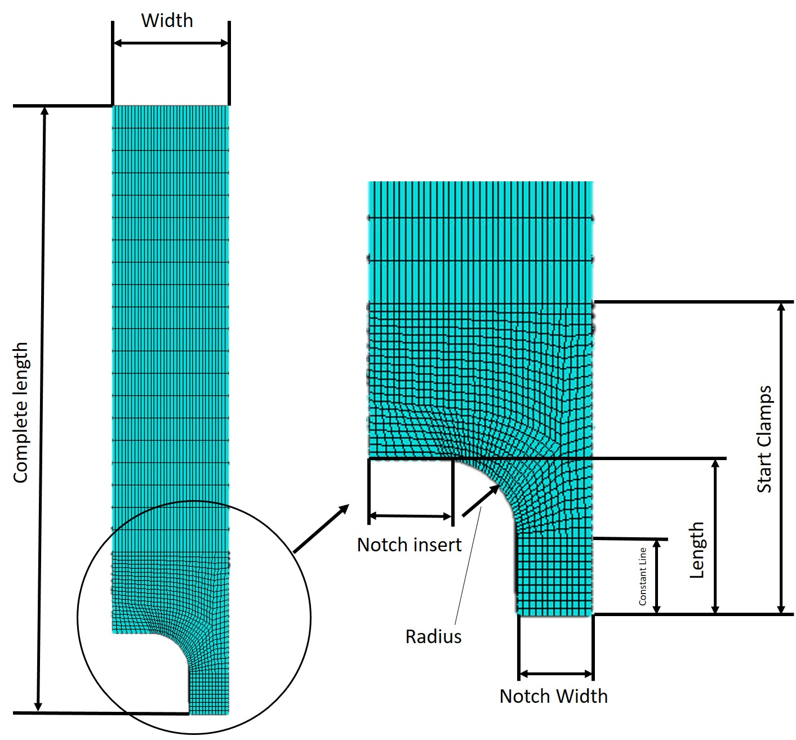

# Design samples

Please cite the Paper if you use the code ****

The code was tested on the CentOS Linux version using Abaqus 2019 .HF6. All of the Code was written in Python 2.

This Code allows the implementation of an eigenvalue buckling analysis, followed by a static step or a riks step of a complex, layered sample and evaluation in the commercial Abaqus software.

*Define_and_Run_Models.py*
<ul>
<li>Here, your Geometrical and simulational parameters must be defined, and different imperfection sizes can be run for each geometry. </li>
<li>Different numbers and thicknesses of foils and substrates can be defined to analyse the buckling behaviour of the complex laminate.  </li>
</ul>

Graphical representation of the geometrical parameters used in the simulation:

The Folder “Codes” includes the following files:

*Boundary_conditions.py:*
<ul>
	<li>Allows the implementation of boundary conditions of the sample, including a clamping of the sample as in the experimental case</li>
</ul>

*evaluate_sample.py:*
<ul>
	<li> Allows the evaluation of both the buckling step that follows the eigenvalue analysis </li>
	<li> Shows how to extract data from several model paths. </li>
</ul>

*geometry_functions.py:*
<ul>
	<li>Implements the sample geometry, including all substrate/foil sections. The basis geometry is designed to fit grips designed by Johannes Reiser in his PhD Thesis “Strain Localization under Fatigue Loading” also see 10.5151/meceng-wccm2012-18609 for details </li>
</ul>

*job_definition.py:*
<ul>
	<li>Allows to create of a buckling analysis right after an eigenvalue buckling step; automatically creates and changes the input file to allow different imperfection sizes to be calculated. </li>
</ul>

*material_model.py:*
<ul>
	<li>Here your material model can be defined. Currently, values from Fellner et al. (10.1109/EuroSimE.2014.6813788) are implemented. </li>
	<li>Allows implementation of orthotropic material parameters and checks if they are valid input parameters</li>
</ul>

*meshing.py:*
<ul>
	<li>Generates a mesh for the sample, including parameters to define the seeds for foils and substrates differently. </li>
</ul>

*run_simulation.py:*
<ul>
	<li>Calls all the files correctly to generate the models and their data extraction. </li>
</ul>

*step_definition.py:*
<ul>
	<li>Creates the eigenvalue buckling step. </li>
</ul>

*tools.py:*
<ul>
	<li>Implements different functions needed to run the model. </li>
</ul>

**µm UNIT System used:**

LENGTH            µm

FORCE             µN

MASS              kg

TIME              s

STRESS            MPa

ENERGY            pJ

DENSITY           kg/µm^3 = 10^18*kg/m^3

**Codes by Claus O. W. Trost**

Published under a Creative Commons license:
https://creativecommons.org/licenses/by-nc-nd/4.0/
